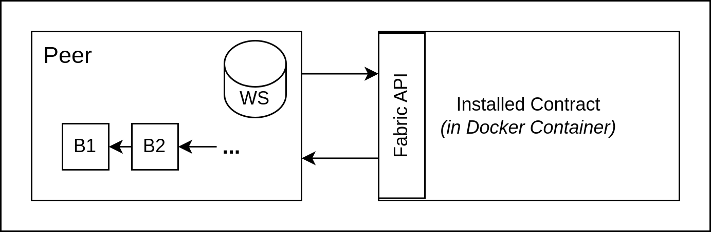

# Modeling and verifying Hyperledger Fabric Networks
## How to Use This Prototype

1. Download the [core project of JPF](https://github.com/javapathfinder/jpf-core)
2. Build jpf-core (from jpf-core project root, make sure you are building with <=java 11): `./gradlew buildJars`
3. Configure the Model by changing the [`Main` class](https://github.com/AdamZsofi/hyperledger-java-model/blob/main/src/main/java/bme/mit/ftsrg/Main.java) (and even the smart contract under the package [`chaincode`](https://github.com/AdamZsofi/hyperledger-java-model/tree/main/src/main/java/bme/mit/ftsrg/chaincode))
4. Execute JPF from this project's root (use <=java 11!): `<path-to-jpf>/bin/jpf hyperledger-java-model.jpf` ([JPF configuration here](https://github.com/AdamZsofi/hyperledger-java-model/blob/main/hyperledger-java-model.jpf), [documentation on JPF configurations](https://github.com/javapathfinder/jpf-core/wiki/Configuring-JPF))

## Introduction
*TBA from paper*

The next sections are ordered as follows:
1. A summary of how Fabric Networks Work
2. Modeling considerations and the Resulting Model
3. Verification with JPF

## How do Hyperledger Fabric Networks Work
*[source](https://hyperledger-fabric.readthedocs.io/en/release-2.5/peers/peers.html)*

Before this course and this project, I haven't had any experience with blockchain, consensus protocols, smart contracts or Fabric, thus the main part of this project was learning and understanding some key concepts, mainly based on the documentation of Hyperledger Fabric.

In this section I would like to summarize the relevant parts about Fabric network participants and the transaction workflow. Some parts/sentences are taken directly from documentation, sources are added under section titles.

### Network Structure
*[source](https://hyperledger-fabric.readthedocs.io/en/release-2.5/network/network.html)*


A hyperledger fabric network has a lot of participants, shown on the picture. We will not need some of them in this project: CAs are required to create certificates for organizations (shown as R1, R2, R3) and in general, quite a lot of artifacts are signed by several parties in the network, but we do not care about this here. We will just accept that the organizations agreed in a channel configuration (CC*) and every participant is added and ready.

The first participants on the figure are applications or clients (shown as A*), peers (shown as P*) and orderers or ordering services (shown as O). Peers have their own ledger copies (L*) and can have contracts installed (S*). All of these participants join separate, isolated channels to exchange transaction proposals, blocks, etc.

### Overview of the Workflow
The client performs various operations, including querying the ledger and ledger updates - the latter is what will be important to us, as it involves the consensus process. The ledger update process consists of three phases involving the client application, peers (including endorsing and non-endorsing peers) and the ordering service.


It is also important to note that beside their local ledger copy, each peer has a world state as well - which are the current valid values calculated based on their ledger copy. This is shown below.



### Phase 1: Transaction Proposal and Endorsement
#### Transaction Proposal
The client submits a transaction on a peer. There are some possibilites regarding which peers should be required for endorsement, but we will just say that it is mainly based on the channel configuration. This transaction request is similar to a remote procedure call - it invokes a transaction (method) in the contract.

#### Transaction Execution
The endorsing peers receive the transaction request and execute it, which means simulating the transaction request on the current local ledger of the peer and generating a Read-Write set. [Read-Write sets](https://hyperledger-fabric.readthedocs.io/en/latest/readwrite.html) contains a list of keys read for the transaction and their versions (Read set) and the keys of the actually updated values with their new value (Write set). This will be used later for validation.

So a read-write set looks something like this:

```
read set:
{(key, version)}

write set:
{(key, value)}
```

After the endorsing peers return the read-write sets, they are returned to the client to be signed and then they are forwarded as a signed "transaction envelope" to the ordering service.

### Phase 2: Transaction Submission and Ordering

After the envelope is sent from the client to the orderer, the orderer verifies signatures and orders the incoming transactions and packages them into blocks. The transactions are **not** necessarily put into the blocks in the same order they were proposed in. But from here on, the order of transactions is fixed and can not be changed.

Blocks are then distributed to all of the peers on the channel.

### Phase 3: Transaction Validation and Commitment
At this point there might be peers that do not have the same contract (or chaincode) installed as the endorsing peers, but they do not need it to be. For validation, they just have to check for each transaction based on the Read/Write set, if in their current local ledger the version of the values read is still not higher than in the R/W set. Passing that test means passing validation, which means that the transaction can be commited to their ledger by carrying out the writes from the write set, updating the world state of the peer and sending out events about this. Peers are deterministic, so the ledger updates should be the same on all of them. If validation fails, the transaction is marked invalid and it will not be commited, although the fact that it was there as an invalid transaction will be added to the ledger.

There is a good example for validation available [here](https://hyperledger-fabric.readthedocs.io/en/latest/readwrite.html#example-simulation-and-validation).

## More about Ordering
*[source](https://hyperledger-fabric.readthedocs.io/en/release-2.5/orderer/ordering_service.html#phase-two-ordering-and-packaging-transactions-into-blocks)*

### What is Ordering
#### Other, not permissioned blockchains (any node can participate in the consensus process)
Transactions are ordered and bundled into blocks. Because of this, these systems rely on probabilistic consensus algorithms which eventually guarantee ledger consistency to a high degree of probability, but which are still vulnerable to divergent ledgers (also known as a ledger “fork”)

#### Hyperledger Fabric, however, is permissioned
Fabric features ordering nodes (or orderers), which together form an ordering service. Because Fabric’s design relies on deterministic consensus algorithms, any block validated by the peer is guaranteed to be final and correct. Ledgers cannot fork the way they do in many other distributed and permissionless blockchain networks.

### Orderers and the transaction flow
*"For an endorsed transaction, the gateway service forwards the transaction to the ordering service, which orders it with other endorsed transactions, and packages them all into a block."*

- Orderers collectively form the ordering service
    - "sequencing of transactions in a block is not necessarily the same as the order received by the ordering service, since there can be multiple ordering service nodes that receive transactions at approximately the same time"
    - BUT order is strict after ordering (for validation and commiting by peers)
- Transactions come in concurrently
- **Block size**: Channel configuration,
    - `BatchSize`: desired size,
    - `BlockSize`: elapsed duration for a block,
    - Blocks are also ordered
- Blocks (when finished): 
    - are saved to the Orderer's ledger
    - and distributed to all peers on channel
- Orderers **DO NOT** execute chaincode and process transactions (i.e. orderer does not care about transaction content)

### Ordering service implementations

*Note: Most of this section will not be in focus for this project, but I kept it, as I think it is interesting.*

We will only detail Raft, as Kafka and Solo are deprecated.

#### Raft

- CFT ordering service
    - "Because the system can sustain the loss of nodes, including leader nodes, as long as there is a majority of ordering nodes (what’s known as a “quorum”) remaining, Raft is said to be “crash fault tolerant” (CFT). In other words, if there are three nodes in a channel, it can withstand the loss of one node (leaving two remaining)."
    - "you would want to spread these nodes across data centers and even locations"
    - "With Raft, each organization can have its own ordering nodes, participating in the ordering service, which leads to a more decentralized system."
    - "Raft allows the users to specify which ordering nodes will be deployed to which channel. In this way, peer organizations can make sure that, if they also own an orderer, this node will be made a part of a ordering service of that channel"
- Raft is NOT BFT, but:
    - "Raft is the first step toward Fabric’s development of a byzantine fault tolerant (BFT) ordering service. As we’ll see, some decisions in the development of Raft were driven by this. If you are interested in BFT, learning how to use Raft should ease the transition." 
    - "Ordering nodes can be added or removed from a channel as needed as long as only a single node is added or removed at a time. While this configuration creates more overhead in the form of redundant heartbeat messages and goroutines, it lays necessary groundwork for BFT."
- "leader and follower" model
    - "a leader node is [dynamically] elected (per channel) and its decisions are replicated by the followers."
- loss of transactions!
    - "Raft ordering service can lose transactions after acknowledgement of receipt has been sent to a client. For example, if the leader crashes at approximately the same time as a follower provides acknowledgement of receipt. Therefore, application clients should listen on peers for transaction commit events regardless (to check for transaction validity), but extra care should be taken to ensure that the client also gracefully tolerates a timeout in which the transaction does not get committed in a configured timeframe. Depending on the application, it may be desirable to resubmit the transaction or collect a new set of endorsements upon such a timeout."

##### Raft Concepts
- **Log Entry** - primary unit of work; consistent if majority agrees on entries and their order
- **Consenter Set** - Ordering nodes actively participating in consensus for a given channel
- **FSM** - Every ordering node has one, ensures deterministic functioning of nodes
- **Quorum** (majority) - describes minimum number of consenters that need to affirm proposal for transaction ordering. e.g. 2 out of 3, 3 out of 5, ..., is needed for a quorum
    - If not enough nodes available, ordering service becomes unavailable, no new logs can be committed *if some ordering nodes can be temporarily down, when does the number needed for quorum change - e.g. we had 5 nodes, now we have 3, do we need 2 or 3 for quorum - irrelevant question, we will not model this (only as a black-box failure)*
- **Leader** - role, always a single leader node elected, ingests new log entries, replicates them to followers, manages when an entry is committed, transactions are automatically routed to leader
- **Follower** - the other role, receives logs, replicates them (deterministically, see FSM), also receives heartbeat - if not, leader is reelected by followers
- **Candidate** - third, temporary role during leader election
- **Snapshots** - connected to how many log entries (and blocks) will be kept in the long term

## Model Description

From the above information, we created a rough, abstract model of a Fabric network.

### Error Property

The error property plays a key role in finding the right level of abstraction. Some ideas regarding the property that came up were:
- endorsing nodes (maybe even whole organizations) fall out (e.g. due to a local power outage), making it impossible to follow the endorsement policies
    - *issue: it is mostly trivial that if this happens that will be problematic - verification did not sound too interesting*
- classic network errors - messages inbetween participants being lost or reordered
    - *issue: really hard to include networking levels in the model, number of problems can easily explode (can a message get lost anywhere? or not?); Fabric gossip protocols seem to be more complex than ideal for this project*
- DoS attack (the platform has no admission control)
- Age of information issues (there are no guarantees on how long will it take for the ledger update transaction to be commited)
    - *modeling time in any way easily leads to complex models*
- Malicious orderer: Raft is not BFT - what if the ordering service has malicious nodes and reorders or loses transactions on purpose?
    - *we chose this property*

### Modeling decisions

Some of the important decisions regarding this is:
- we would like to be capable to (fairly) easily insert and switch the contract code in the model - real contracts, written in Java
- separate ordering nodes will not be modeled, only a single ordering service, as we do not want to implement any complex protocols like Raft
- fully distributed/separate participants or complex network models are not needed, but we want to model the notion of asynchronous network communication (mainly with queues)
- we would like to be able to change the network structure later, so we need a flexible solution in this regard
- in any other decisions, whenever possible, try to choose the simpler solution to avoid scalability issues with the model checker

### Model

The model is a Java 11 gradle project, as this is the highest Java version currently supported by JPF. The code is structured the following way:

```
.
|-- Main.java
|-- chaincode
|   `-- TrainCrossroadContract.java
|-- mockFabric
|   |-- ChaincodeStub.java
|   |-- Context.java
|   |-- ContractInterface.java
|   `-- TrainCrossroadChaincodeStub.java
`-- model
    |-- FabricNetworkBuilder.java
    |-- Network.java
    |-- NetworkParticipant.java
    |-- channel
    |   `-- Channel.java
    |-- data
    |   |-- Block.java
    |   |-- Ledger.java
    |   |-- ReadWriteSet.java
    |   `-- TransactionExecutionStatus.java
    |-- participants
        |-- Organization.java
        |-- application
        |   `-- TrainClient.java
        |-- ordering
        |   |-- FaultMode.java
        |   `-- OrderingService.java
        `-- peers
            `-- Peer.java
```

The role of the different packages are:
- `chaincode`: holds the current demo contract (which just switches the boolean `canGo` value to true or false). The code is really fabric chaincode, except that annotations are commented out for now and imports are changed from the Fabric API packages to classes in the `mockFabric` package
- `mockFabric`: holds mock classes for Fabric API classes that contracts depend on. Unfortunately, currently it requires a contract specific Chaincode Stub implementation - with further work we might be able to eliminate the need for this.
- `model`: the Fabric network model itself, including model classes of the channel, participants (`participants`), data sent inbetween them (`data`) and the `Network` itself, which is responsible for a cascase "stepping" of participants during execution (this is not yet done with multithreading, but this can be modified if needed for later error properties)

Through the `FabricNetworkBuilder` it is possible to put together different networks by adding organizations, channels, peers, etc. This is done in the `main` method.

## JPF

[Java Pathfinder](https://github.com/javapathfinder) is an extensible software analysis framework for java bytecode. For this project only the core is used. The configuration is simple (`hyperledger-java-model.jpf`), we just tell jpf what the target (main) class is, we add the classpath, add vm.assert as the property (so that JPF checks for assert violations) and turn cg.enumerate_random to true, so that each branch coming from random values is enumerated, so that we do not miss any part of the state space.

#### Input and error property

For now, I added two configurable points to the orderer (see the top of the `Main` class):
- `blockSize`: amount of transactions in a block
- `ordererFaultMode`, for which the possible values are: `allFaults, canReorder, canLose, noFaults` (all faults means the orderer can lose any transaction and can also reorder the transactions in the block in any way)

Furthermore, in the `main` method, we can add what transaction we would like our client (application) to propose (e.g. `client.updateCrossroadState(false);`) and then we use `network.execute()` to play out the scenario (step the participants until there are no more steps to be done). After these, we can add an assert as the error property, e.g.:

`assert Objects.equals(p1.getWorldState("canGo"), "false") : "canGo should be false in the end!";`

Which means that after the execution is done, we would like to make sure that `canGo` is false in the ledger of P1, i.e., we won't let cars go through the crossing.

After executing JPF (see the JPF configuration file for commands), it found the issue with the assertion and even gave the output for an erroneus execution. I also played around with the block size, fault modes, different input sequences and some slightly different properties and the model worked as expected, producing assertions violations or no violations in different cases.

An example JPF output for a violation (blockSize=2, ordererFaultMode=canLose, input is setting `canGo` to f,t,f,f,t,f, property is the same as the example above) is available under [doc/output-example.txt](./output-example.txt).
